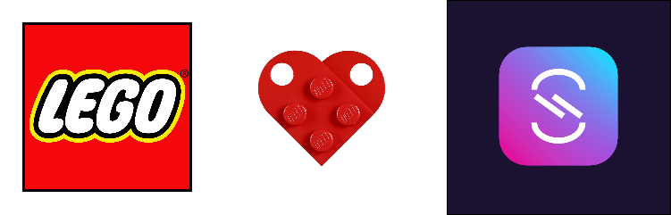

# AsyncAPI.NET

  


The AsyncAPI.NET SDK contains a useful object model for the AsyncAPI specification in .NET along with common serializers to extract raw AsyncAPI JSON and YAML documents from the model as well.

[CHANGELOG](https://github.com/LEGO/AsyncAPI.NET/blob/main/CHANGELOG.md)  
[Wiki and getting started guide](https://github.com/LEGO/AsyncAPI.NET/wiki)

## Installation

Install the NuGet packages:
### AsyncAPI.NET
[](https://www.nuget.org/packages/AsyncAPI.NET/)  
[](https://www.nuget.org/packages/AsyncAPI.NET/)  

### AsyncAPI.Readers
[](https://www.nuget.org/packages/AsyncAPI.NET.Readers/)  
[](https://www.nuget.org/packages/AsyncAPI.NET.Readers/)  

### AsyncAPI.Bindings
[](https://www.nuget.org/packages/AsyncAPI.NET.Bindings/)  
[](https://www.nuget.org/packages/AsyncAPI.NET.Bindings/)  
## Example Usage

Main classes to know:

* AsyncApiStringReader
* AsyncApiStringWriter
  * There is an extension on the AsyncApiDocument type which allows Serializing as well (`new AsyncApiDocument().SerializeAsJson()` or `new AsyncApiDocument().SerializeAsYaml()`

### Writing

```csharp
var myFirstAsyncApi = new AsyncApiDocument
{
  Info = new AsyncApiInfo
  {
    Title = "my first asyncapi"
  },
  Channels = new Dictionary<string, AsyncApiChannel>
  {
    {
	"users", new AsyncApiChannel
	{
	    Subscribe = new AsyncApiOperation
	    {
		OperationId = "users",
		Description = "my users channel"
	    }
	}
    }
  }
};
var yaml = myFirstAsyncApi.SerializeAsYaml();
//asyncapi: '2.5.0'
//  info:
//    title: my first asyncapi
//  channels:
//    users:
//      subscribe:
//        operationId: users
//        description: my users channel
```

### Reading

```csharp
var httpClient = new HttpClient
{
  BaseAddress = new Uri("https://raw.githubusercontent.com/asyncapi/spec/"),
};

var stream = await httpClient.GetStreamAsync("master/examples/streetlights-kafka.yml");
var asyncApiDocument = new AsyncApiStreamReader().Read(stream, out var diagnostic);
```

#### Reading External $ref

You can read externally referenced AsyncAPI documents by setting the `ReferenceResolution` property of the `AsyncApiReaderSettings` object to `ReferenceResolutionSetting.ResolveAllReferences` and providing an implementation for the `IAsyncApiExternalReferenceReader` interface. This interface contains a single method to which the built AsyncAPI.NET reader library will pass the location content contained in a `$ref` property (usually some form of path) and interface will return the content which is retrieved from wherever the `$ref` points to as a `string`. The AsyncAPI.NET reader will then automatically infer the `T` type of the content and recursively parse the external content into an AsyncAPI document as a child of the original document that contained the `$ref`. This means that you can have externally referenced documents that themselves contain external references. 

This interface allows users to load the content of their external reference however and from whereever is required. A new instance of the implementor of `IAsyncApiExternalReferenceReader` should be registered with the `ExternalReferenceReader` property of the `AsyncApiReaderSettings` when creating the reader from which the `GetExternalResource` method will be called when resolving external references.

Below is a very simple example of implementation for `IAsyncApiExternalReferenceReader` that simply loads a file and returns it as a string found at the reference endpoint.
```csharp
using System.IO;

public class AsyncApiExternalFileSystemReader : IAsyncApiExternalReferenceReader
{
    public string Load(string reference)
    {
        return File.ReadAllText(reference);
    }
}
```

This can then be configured in the reader as follows:
```csharp
var settings = new AsyncApiReaderSettings
{
  ReferenceResolution = ReferenceResolutionSetting.ResolveAllReferences,
  ExternalReferenceReader = new AsyncApiExternalFileSystemReader(),
};
var reader = new AsyncApiStringReader(settings);
```

This would function for a AsyncAPI document with following reference to load the content of `message.yaml` as a `AsyncApiMessage` object inline with the document object.
```yaml
asyncapi: 2.3.0
info:
  title: test
  version: 1.0.0
channels:
  workspace:
    publish:
      message:
        $ref: "../../../message.yaml"
```

### Bindings
To add support for reading bindings, simply add the bindings you wish to support, to the `Bindings` collection of `AsyncApiReaderSettings`.
There is a nifty helper to add different types of bindings, or like in the example `All` of them.

```csharp
var settings = new AsyncApiReaderSettings();
settings.Bindings = BindingsCollection.All;
var asyncApiDocument = new AsyncApiStringReader(settings).Read(stream, out var diagnostic);
```

## Attribution

* [OpenAPI.Net](https://github.com/microsoft/OpenAPI.NET) - [MIT License](https://github.com/microsoft/OpenAPI.NET/blob/vnext/LICENSE)
* [YamlDotNet](https://github.com/aaubry/YamlDotNet) - [MIT License](https://github.com/aaubry/YamlDotNet/blob/master/LICENSE.txt)

## Contribution

This project welcomes contributions and suggestions.
Do you want to contribute to the project? Find out how [here](CONTRIBUTING.md).

## License
[Modified Apache 2.0 (Section 6)](https://github.com/LEGO/AsyncAPI.NET/blob/main/LICENSE)
